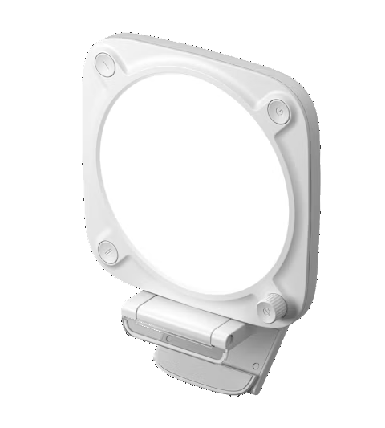

# Elgato Key Light Neo USB controller



`elgatolight` gives Linux direct USB control of one or more Elgato Key Light Neo
devices—from a fast CLI or as native Home Assistant lights.

- Control power, brightness, color temperature, and both hardware presets.
- See physical controls and USB hotplug changes in real time.
- Address multiple lights by stable device ID.

> **Disclaimer:** Made by an automated agent. The code was not extensively reviewed;
> use at your own risk. It works on my machine. The docs are fine, though.

## CLI

Install the latest verified release for your Linux architecture:

```sh
(
  release_installer="$(mktemp)" || exit
  trap 'rm -f "$release_installer"' 0
  curl -fsSL --proto '=https' --proto-redir '=https' \
    https://git2.riper.fr/ztec/elgatocmd/raw/branch/main/install.sh \
    -o "$release_installer" &&
    sh "$release_installer"
)
```

The installer and `elgatolight self-update` verify signed checksums against
[Tmplt's public key registry](https://git2.riper.fr/ztec/tmplt/src/branch/main/release-keys).
See the [technical reference](docs/technical.md#installation-and-usb-access)
for the explicit checksum-only fallback when Ed25519-capable OpenSSL is unavailable.

Choose how the light should be used:

- `elgatolight setup`: user service, started when you log in.
- `sudo elgatolight setup`: system service, started when the computer boots.
- `elgatolight setup --scope none`: command-line use only; sudo is used only for the USB rule.

For CLI-only use, reconnect the light once after setup, then try:

```sh
elgatolight info
elgatolight on
elgatolight brightness 30
elgatolight temperature 4500
elgatolight preset 1
elgatolight watch
```

One connected light is selected automatically. With several, use the stable ID
shown by `info`:

```sh
elgatolight --light A7BTB0000000ZZ brightness 30
```

`watch` is a live dashboard; `log` emits JSON Lines for automation. Run
`elgatolight --help` for the complete command list.

## Home Assistant

The bundled integration creates a native light entity for each USB light and
keeps power, brightness, temperature, availability, and physical changes in
sync. Scenes `<light name> I` and `<light name> II` recall the presets stored by
the matching physical buttons.

<table>
  <tr><td width="50%"></td><td width="50%"> </td></tr>
  <tr><td valign="top"><strong>Bridge.</strong> Every detected USB light appears under one integration.</td><td valign="top"><strong>Controls.</strong> Manage power, brightness, temperature, and physical presets.</td></tr>
</table>

1. In **HACS → Integrations → Custom repositories**, add
   `https://github.com/ztec/elgatocmd` as an **Integration**.
2. Download **Elgato USB Light Bridge**, restart Home Assistant, then add it
   under **Settings → Devices & services**.
3. Install `elgatolight` on the Linux computer connected to the light and run:

```sh
elgatolight setup --ha-url https://homeassistant.example.test
```

The setup process opens Home Assistant authorization in your browser, installs
USB access, and configures the daemon service. Run it as your regular user to
start the service at login, or with `sudo` to start it at boot.

## Development and reference

The Dockerfile is the shared Go and Python environment for local development
and CI. Run `make ci` with Podman or Docker, `make build` for a tested
binary, or `make shell` for the optional Distrobox workflow.

See the [Technical documentation](docs/technical.md) for configuration, service
management, troubleshooting, and protocol details. Focused guides cover
[development](docs/development.md), [releases](docs/releasing.md), and
[template updates](docs/template.md).

## License

Licensed under the [GNU General Public License v3.0 only](LICENSE).
